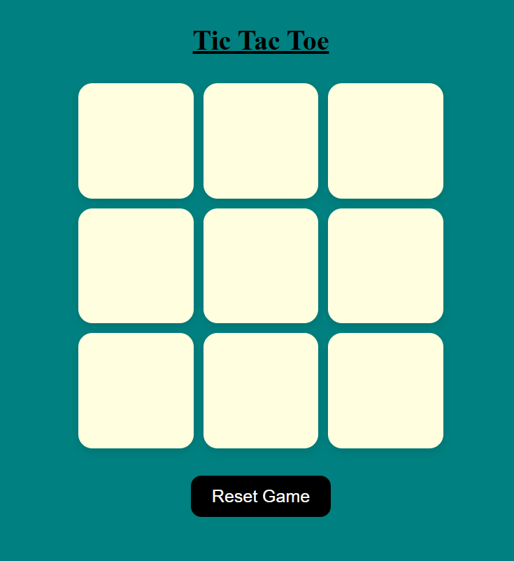
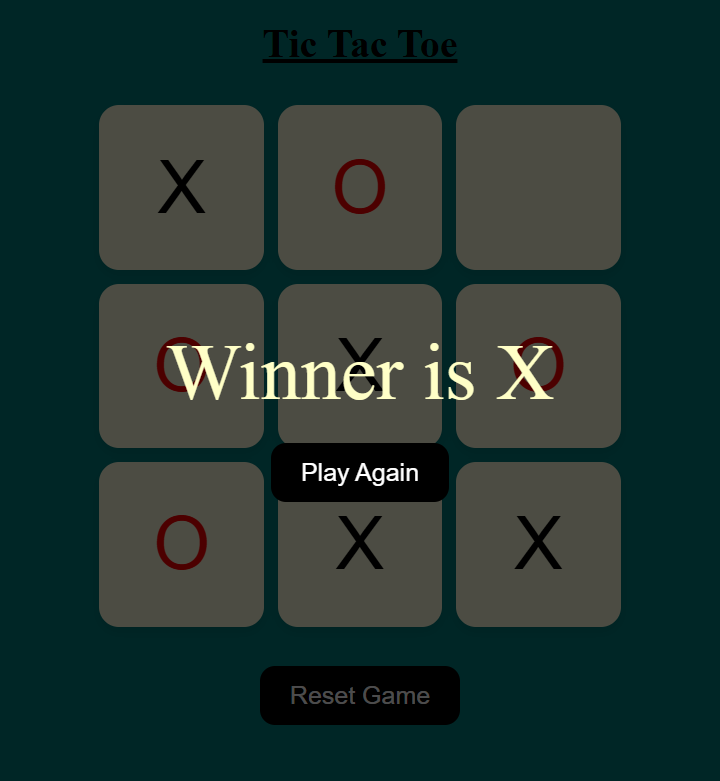

# 🎮 Tic Tac Toe Game

A simple and interactive **Tic Tac Toe** game built using **HTML, CSS, and JavaScript**. This project allows two players to play against each other in the browser with a clean and responsive interface.

## 📌 Features

- ✨ Two-player gameplay (X vs O)
- 🏆 Automatically detects the winner
- 🤝 Detects a draw when all cells are filled
- 🔄 Reset button to start a new game
- 📱 Responsive design for desktop and mobile
- 🎨 Clean and user-friendly interface

## 🛠️ Technologies Used

- 🌐 HTML5
- 🎨 CSS3
- ⚡ JavaScript (ES6)

## 📂 Project Structure

tic-tac-toe/
│── index.html
│── style.css
│── script.js
│── images/
│     ├── Home_page.png
│     └── Winner_page.png
└── README.md

## 🚀 How to Run the Project

1. Clone this repository

git clone https://github.com/shrutidubey861/tic-tac-toe-game.git

2. Open the project folder.

3. Open `index.html` in your browser.

No installation or dependencies are required.

---

## 📸 Screenshots

### Home Screen

### Winner Screen

## 💡 Future Improvements

- 🤖 Single-player mode with AI
- 🎵 Sound effects
- 🌙 Dark mode
- 📊 Scoreboard
- ✨ Winning animation

## 🌐 Live Demo

https://tic-tac-toe-game-shruti22.vercel.app/

## 👩‍💻 Author

**Shruti Dubey**

- GitHub: https://github.com/shrutidubey861

⭐ If you like this project, don't forget to star the repository!
